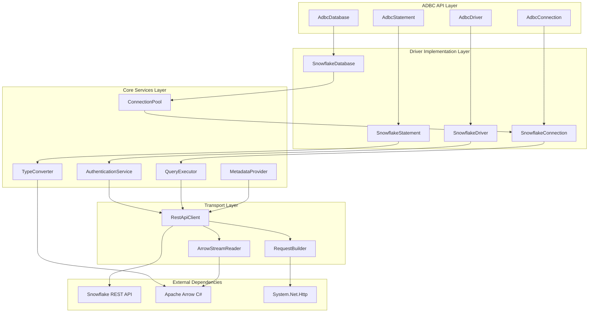

# Design Document: Native C# Snowflake ADBC Driver

## Overview

This document outlines the design for a native C# Snowflake driver that implements the Apache Arrow Database Connectivity (ADBC) API. The driver will provide direct connectivity to Snowflake databases while returning results in Apache Arrow columnar format, eliminating the need for the current Interop wrapper approach.

The design leverages Snowflake's native Arrow support through their SQL REST API, which can return results directly in Arrow format (`arrowv1`). This approach ensures optimal performance by avoiding unnecessary data conversions while maintaining full compatibility with the ADBC specification.

Key design principles:
- **Zero-copy data transfer**: Leverage Arrow's columnar format throughout the pipeline
- **Native implementation**: Direct C# implementation without Go interop dependencies
- **ADBC compliance**: Full adherence to ADBC API standards and conventions
- **Performance optimization**: Connection pooling, streaming, and efficient memory management
- **Extensibility**: Modular architecture supporting future Snowflake features

## Architecture

The driver follows a layered architecture that separates concerns and provides clear interfaces between components:



### Layer Responsibilities

**ADBC API Layer**: Implements the standard ADBC interfaces that client applications interact with. This layer ensures compatibility with existing ADBC tooling and applications.

**Driver Implementation Layer**: Provides Snowflake-specific implementations of ADBC interfaces. This layer handles Snowflake-specific logic while maintaining ADBC contract compliance.

**Core Services Layer**: Contains the business logic for authentication, query execution, type conversion, metadata retrieval, and connection management. These services are shared across the driver implementation.

**Transport Layer**: Handles low-level communication with Snowflake's REST API, including request construction, response parsing, and Arrow stream processing.

## Components and Interfaces

### ADBC Interface Implementations

#### SnowflakeDriver
The main driver class implementing `IAdbcDriver`:

```csharp
public class SnowflakeDriver : IAdbcDriver
{
    public string Name => "Snowflake ADBC Driver";
    public string Version => AssemblyVersion;
    
    public IAdbcDatabase Open(string connectionString);
    public void Dispose();
}
```

**Responsibilities**:
- Driver registration and initialization
- Connection string parsing and validation
- Database instance creation
- Resource cleanup and disposal

#### SnowflakeDatabase
Implements `IAdbcDatabase` for database-level operations:

```csharp
public class SnowflakeDatabase : IAdbcDatabase
{
    public IAdbcConnection Connect();
    public Task<IAdbcConnection> ConnectAsync(CancellationToken cancellationToken);
    public ArrowSchema GetTableSchema(string catalogName, string schemaName, string tableName);
    public RecordBatch GetObjects(GetObjectsDepth depth, string catalogPattern, string schemaPattern, string tablePattern, string[] tableTypes, string columnPattern);
}
```

**Responsibilities**:
- Connection management and pooling
- Database-level metadata operations
- Schema discovery and introspection
- Connection lifecycle management

#### SnowflakeConnection
Implements `IAdbcConnection` for connection-level operations:

```csharp
public class SnowflakeConnection : IAdbcConnection
{
    public IAdbcStatement CreateStatement();
    public Task<IAdbcStatement> CreateStatementAsync(CancellationToken cancellationToken);
    public void SetOption(string key, string value);
    public string GetOption(string key);
    public RecordBatch GetTableTypes();
    public void Commit();
    public void Rollback();
}
```

**Responsibilities**:
- Statement creation and management
- Transaction control (where supported)
- Connection-specific configuration
- Session state management

#### SnowflakeStatement
Implements `IAdbcStatement` for query execution:

```csharp
public class SnowflakeStatement : IAdbcStatement
{
    public void SetSqlQuery(string query);
    public void Bind(RecordBatch batch);
    public ArrowArrayStream ExecuteQuery();
    public Task<ArrowArrayStream> ExecuteQueryAsync(CancellationToken cancellationToken);
    public long ExecuteUpdate();
    public void Prepare();
    public ArrowSchema GetParameterSchema();
}
```

**Responsibilities**:
- SQL query execution
- Parameter binding and validation
- Result set streaming
- Prepared statement management

### Core Services

#### AuthenticationService
Handles various Snowflake authentication methods:

```csharp
public interface IAuthenticationService
{
    Task<AuthenticationToken> AuthenticateAsync(AuthenticationConfig config, CancellationToken cancellationToken);
    Task<AuthenticationToken> RefreshTokenAsync(AuthenticationToken token, CancellationToken cancellationToken);
    void InvalidateToken(AuthenticationToken token);
}

public class AuthenticationService : IAuthenticationService
{
    private readonly IKeyPairAuthenticator _keyPairAuth;
    private readonly IOAuthAuthenticator _oauthAuth;
    private readonly IBasicAuthenticator _basicAuth;
    private readonly ISsoAuthenticator _ssoAuth;
}
```

**Authentication Methods Supported**:
- Username/Password (Basic Authentication)
- RSA Key Pair Authentication
- OAuth 2.0 Token Authentication
- Single Sign-On (SSO) Authentication
- Multi-Factor Authentication (MFA)

#### QueryExecutor
Manages query execution and result processing:

```csharp
public interface IQueryExecutor
{
    Task<QueryResult> ExecuteQueryAsync(QueryRequest request, CancellationToken cancellationToken);
    Task<QueryResult> ExecutePreparedStatementAsync(PreparedStatement statement, ParameterSet parameters, CancellationToken cancellationToken);
    Task CancelQueryAsync(string queryId, CancellationToken cancellationToken);
}

public class QueryExecutor : IQueryExecutor
{
    private readonly IRestApiClient _apiClient;
    private readonly IArrowStreamReader _streamReader;
    private readonly ITypeConverter _typeConverter;
}
```

**Key Features**:
- Asynchronous query execution
- Query cancellation support
- Multi-statement query handling
- Result streaming and pagination
- Error handling and retry logic

#### TypeConverter
Converts between Snowflake and Arrow data types:

```csharp
public interface ITypeConverter
{
    ArrowType ConvertSnowflakeTypeToArrow(SnowflakeDataType snowflakeType);
    SnowflakeDataType ConvertArrowTypeToSnowflake(ArrowType arrowType);
    RecordBatch ConvertSnowflakeResultToArrow(SnowflakeResultSet resultSet);
    ParameterSet ConvertArrowBatchToParameters(RecordBatch batch);
}
```

**Type Mapping Strategy**:
- Direct mapping for compatible types (VARCHAR → String, NUMBER → Decimal)
- Structured handling for semi-structured types (VARIANT → JSON, ARRAY → List)
- Precision preservation for numeric types
- Timezone handling for temporal types
- NULL value propagation

#### MetadataProvider
Provides database schema and metadata information:

```csharp
public interface IMetadataProvider
{
    Task<DatabaseMetadata> GetDatabasesAsync(string pattern, CancellationToken cancellationToken);
    Task<SchemaMetadata> GetSchemasAsync(string databasePattern, string schemaPattern, CancellationToken cancellationToken);
    Task<TableMetadata> GetTablesAsync(string databasePattern, string schemaPattern, string tablePattern, string[] tableTypes, CancellationToken cancellationToken);
    Task<ColumnMetadata> GetColumnsAsync(string databasePattern, string schemaPattern, string tablePattern, string columnPattern, CancellationToken cancellationToken);
}
```

**Metadata Sources**:
- INFORMATION_SCHEMA queries
- SHOW commands (SHOW DATABASES, SHOW TABLES, etc.)
- DESCRIBE statements for detailed column information
- Snowflake-specific metadata (clustering keys, table types)

#### ConnectionPool
Manages connection pooling for performance optimization:

```csharp
public interface IConnectionPool
{
    Task<IPooledConnection> AcquireConnectionAsync(ConnectionConfig config, CancellationToken cancellationToken);
    void ReleaseConnection(IPooledConnection connection);
    void InvalidateConnection(IPooledConnection connection);
    Task<PoolStatistics> GetStatisticsAsync();
}

public class ConnectionPool : IConnectionPool
{
    private readonly ConcurrentDictionary<string, ConnectionPoolEntry> _pools;
    private readonly SemaphoreSlim _poolSemaphore;
    private readonly Timer _cleanupTimer;
}
```

**Pooling Features**:
- Per-connection-string pooling
- Configurable pool size limits
- Connection validation and health checks
- Automatic cleanup of idle connections
- Connection lifetime management

### Transport Layer

#### RestApiClient
Handles HTTP communication with Snowflake's REST API:

```csharp
public interface IRestApiClient
{
    Task<ApiResponse<T>> PostAsync<T>(string endpoint, object request, AuthenticationToken token, CancellationToken cancellationToken);
    Task<Stream> GetArrowStreamAsync(string url, AuthenticationToken token, CancellationToken cancellationToken);
    Task<ApiResponse<T>> GetAsync<T>(string endpoint, AuthenticationToken token, CancellationToken cancellationToken);
}
```

**Key Features**:
- JWT token authentication
- Request/response serialization
- Error handling and retry logic
- Compression support
- Connection reuse and HTTP/2 support

#### ArrowStreamReader
Processes Arrow format responses from Snowflake:

```csharp
public interface IArrowStreamReader
{
    Task<ArrowArrayStream> ReadStreamAsync(Stream arrowStream, CancellationToken cancellationToken);
    Task<RecordBatch> ReadBatchAsync(Stream arrowStream, CancellationToken cancellationToken);
    ArrowSchema ReadSchema(Stream arrowStream);
}
```

**Processing Features**:
- Streaming Arrow data processing
- Schema validation and compatibility checking
- Memory-efficient batch processing
- Error recovery and validation

## Data Models

### Configuration Models

#### ConnectionConfig
Represents connection configuration parameters:

```csharp
public class ConnectionConfig
{
    public string Account { get; set; }
    public string User { get; set; }
    public string Database { get; set; }
    public string Schema { get; set; }
    public string Warehouse { get; set; }
    public string Role { get; set; }
    public AuthenticationConfig Authentication { get; set; }
    public ConnectionPoolConfig PoolConfig { get; set; }
    public TimeSpan QueryTimeout { get; set; }
    public TimeSpan ConnectionTimeout { get; set; }
    public bool EnableCompression { get; set; }
    public LogLevel LogLevel { get; set; }
}
```

#### AuthenticationConfig
Represents authentication configuration:

```csharp
public class AuthenticationConfig
{
    public AuthenticationType Type { get; set; }
    public string Password { get; set; }
    public string PrivateKeyPath { get; set; }
    public string PrivateKeyPassphrase { get; set; }
    public string OAuthToken { get; set; }
    public string OAuthRefreshToken { get; set; }
    public Dictionary<string, string> SsoProperties { get; set; }
}

public enum AuthenticationType
{
    UsernamePassword,
    KeyPair,
    OAuth,
    Sso,
    ExternalBrowser
}
```

### Query Models

#### QueryRequest
Represents a query execution request:

```csharp
public class QueryRequest
{
    public string Statement { get; set; }
    public string Database { get; set; }
    public string Schema { get; set; }
    public string Warehouse { get; set; }
    public string Role { get; set; }
    public TimeSpan Timeout { get; set; }
    public ResultFormat Format { get; set; } = ResultFormat.ArrowV1;
    public Dictionary<string, object> Parameters { get; set; }
    public bool IsMultiStatement { get; set; }
}
```

#### QueryResult
Represents query execution results:

```csharp
public class QueryResult
{
    public string StatementHandle { get; set; }
    public QueryStatus Status { get; set; }
    public ArrowSchema Schema { get; set; }
    public ArrowArrayStream ResultStream { get; set; }
    public long RowCount { get; set; }
    public TimeSpan ExecutionTime { get; set; }
    public List<QueryError> Errors { get; set; }
    public Dictionary<string, object> Metadata { get; set; }
}
```

### Metadata Models

#### TableMetadata
Represents table metadata information:

```csharp
public class TableMetadata
{
    public string CatalogName { get; set; }
    public string SchemaName { get; set; }
    public string TableName { get; set; }
    public string TableType { get; set; }
    public List<ColumnMetadata> Columns { get; set; }
    public List<string> ClusteringKeys { get; set; }
    public DateTime CreatedTime { get; set; }
    public long RowCount { get; set; }
    public long SizeBytes { get; set; }
}
```

#### ColumnMetadata
Represents column metadata information:

```csharp
public class ColumnMetadata
{
    public string ColumnName { get; set; }
    public int OrdinalPosition { get; set; }
    public string DataType { get; set; }
    public bool IsNullable { get; set; }
    public string DefaultValue { get; set; }
    public int? NumericPrecision { get; set; }
    public int? NumericScale { get; set; }
    public int? CharacterMaximumLength { get; set; }
    public ArrowType ArrowType { get; set; }
}
```

### Error Models

#### SnowflakeException
Custom exception for Snowflake-specific errors:

```csharp
public class SnowflakeException : Exception
{
    public string ErrorCode { get; set; }
    public string SqlState { get; set; }
    public string QueryId { get; set; }
    public int? LineNumber { get; set; }
    public int? ColumnNumber { get; set; }
    public Dictionary<string, object> AdditionalProperties { get; set; }
}
```

## Correctness Properties

*A property is a characteristic or behavior that should hold true across all valid executions of a system—essentially, a formal statement about what the system should do. Properties serve as the bridge between human-readable specifications and machine-verifiable correctness guarantees.*

Based on the requirements analysis, the following correctness properties ensure the Snowflake ADBC driver operates correctly across all scenarios:

### Property 1: ADBC Format Compliance
*For any* ADBC method call with valid inputs, the returned response should conform to the ADBC specification format and structure.
**Validates: Requirements 1.2**

### Property 2: Connection String Parsing
*For any* valid ADBC connection string format, the driver should successfully parse all parameters and establish connections with the parsed configuration.
**Validates: Requirements 1.4**

### Property 3: Connection Establishment
*For any* valid connection configuration, the driver should successfully establish a connection to the specified Snowflake account and return a usable connection object.
**Validates: Requirements 2.1**

### Property 4: Parameter Validation
*For any* invalid connection parameters, the driver should reject the connection attempt with descriptive validation errors before attempting to connect.
**Validates: Requirements 2.2**

### Property 5: Resource Cleanup
*For any* connection that is opened and then closed, all associated resources should be properly released and no resource leaks should occur.
**Validates: Requirements 2.5, 5.6**

### Property 6: Connection Pool Reuse
*For any* sequence of connection requests with identical connection parameters, the connection pool should reuse existing connections when available rather than creating new ones.
**Validates: Requirements 2.6**

### Property 7: Authentication Method Support
*For any* valid authentication configuration (username/password, key pair, OAuth, SSO), the authentication provider should successfully authenticate and return valid tokens.
**Validates: Requirements 3.1, 3.2, 3.3, 3.4**

### Property 8: Query Execution with Arrow Results
*For any* valid SQL query, the driver should execute it successfully and return results in Arrow format with correct schema and data.
**Validates: Requirements 4.1**

### Property 9: Synchronous and Asynchronous Execution
*For any* valid query, both synchronous and asynchronous execution methods should produce equivalent results and handle errors consistently.
**Validates: Requirements 4.2**

### Property 10: Multi-Statement Processing
*For any* multi-statement query with valid SQL statements, the driver should process all statements in sequence and return appropriate results for each.
**Validates: Requirements 4.5**

### Property 11: Prepared Statement Parameter Binding
*For any* prepared statement and compatible parameter values, parameter binding should succeed and subsequent execution should use the bound values correctly.
**Validates: Requirements 5.2, 5.3**

### Property 12: Batch Execution Consistency
*For any* prepared statement executed with multiple parameter sets in batch mode, each parameter set should produce the same result as individual executions with the same parameters.
**Validates: Requirements 5.5**

### Property 13: Type Conversion Correctness
*For any* Snowflake data type, conversion to Arrow format should preserve the data value, precision, and semantic meaning without loss of information.
**Validates: Requirements 6.1, 6.4**

### Property 14: Comprehensive Type Support
*For any* standard Snowflake data type (VARCHAR, NUMBER, TIMESTAMP, BOOLEAN, BINARY, VARIANT, JSON, ARRAY, OBJECT), the type converter should handle conversion to appropriate Arrow representations.
**Validates: Requirements 6.2, 6.3**

### Property 15: NULL Value Preservation
*For any* data type conversion involving NULL values, the NULL state should be correctly preserved in the Arrow format representation.
**Validates: Requirements 6.6**

### Property 16: Metadata Format Compliance
*For any* metadata request, the returned catalog information should conform to ADBC standard format and include all required fields.
**Validates: Requirements 7.1**

### Property 17: Metadata Filtering
*For any* metadata request with filtering patterns, only objects matching the specified patterns should be included in the results.
**Validates: Requirements 7.4**

### Property 18: Warehouse Selection
*For any* connection with a specified warehouse, all queries executed on that connection should use the specified warehouse for execution.
**Validates: Requirements 8.1**

### Property 19: Connection Pooling Efficiency
*For any* series of connection requests, the connection pool should reduce the total number of actual database connections compared to creating new connections for each request.
**Validates: Requirements 9.1**

### Property 20: Large Dataset Streaming
*For any* query result exceeding a threshold size, the driver should stream the results rather than loading the entire dataset into memory at once.
**Validates: Requirements 9.2**

### Property 21: Error Code Standardization
*For any* error condition, the driver should return ADBC-compliant error codes and include detailed error information in the standard format.
**Validates: Requirements 10.1, 10.2**

### Property 22: Retry Logic with Backoff
*For any* transient network error, the driver should implement retry logic with exponential backoff and eventually succeed or fail with appropriate error information.
**Validates: Requirements 10.4, 10.6**

### Property 23: Configuration Parameter Validation
*For any* configuration parameter set, invalid parameters should be rejected with specific validation errors that guide users toward correct configuration.
**Validates: Requirements 11.3, 11.6**

### Property 24: Environment Variable Configuration
*For any* sensitive configuration parameter, the driver should support configuration through environment variables as an alternative to connection strings.
**Validates: Requirements 11.4**

### Property 25: Platform Compatibility
*For any* supported platform, the driver should provide identical functionality and behavior across all platform implementations.
**Validates: Requirements 14.5**

### Property 26: Backward Compatibility
*For any* existing ADBC application, the Snowflake driver should work as a drop-in replacement without requiring application code changes.
**Validates: Requirements 14.6**

## Error Handling

The driver implements comprehensive error handling across all layers:

### Error Categories

**Connection Errors**:
- Invalid connection parameters
- Network connectivity issues
- Authentication failures
- Timeout conditions

**Query Errors**:
- SQL syntax errors
- Permission denied errors
- Resource limit exceeded
- Query timeout

**Data Conversion Errors**:
- Unsupported data type conversions
- Precision loss during conversion
- Invalid data format

**System Errors**:
- Out of memory conditions
- Resource exhaustion
- Internal driver errors

### Error Response Format

All errors follow the ADBC error response format:

```csharp
public class AdbcError
{
    public AdbcStatusCode StatusCode { get; set; }
    public string Message { get; set; }
    public string SqlState { get; set; }
    public int VendorCode { get; set; }
    public Dictionary<string, string> Details { get; set; }
}
```

### Retry Strategy

The driver implements intelligent retry logic:

- **Exponential Backoff**: Base delay of 100ms, maximum delay of 30 seconds
- **Jitter**: Random variation to prevent thundering herd
- **Retry Conditions**: Network timeouts, temporary service unavailability, rate limiting
- **Non-Retry Conditions**: Authentication errors, syntax errors, permission denied

## Testing Strategy

The testing strategy employs a dual approach combining unit tests and property-based tests to ensure comprehensive coverage and correctness validation.

### Unit Testing Approach

Unit tests focus on specific examples, edge cases, and integration points:

**Component Testing**:
- Individual service classes (AuthenticationService, QueryExecutor, TypeConverter)
- ADBC interface implementations
- Configuration parsing and validation
- Error handling scenarios

**Integration Testing**:
- End-to-end query execution flows
- Authentication method integration
- Connection pooling behavior
- Metadata retrieval operations

**Edge Case Testing**:
- Boundary conditions for data types
- Large dataset handling
- Connection timeout scenarios
- Resource exhaustion conditions

### Property-Based Testing Configuration

Property-based tests validate universal properties across all inputs using **fast-check** library for C#:

**Test Configuration**:
- Minimum 100 iterations per property test
- Custom generators for Snowflake-specific data types
- Shrinking strategies for minimal failing examples
- Timeout configuration for long-running properties

**Property Test Implementation**:
Each correctness property is implemented as a single property-based test with the following tag format:
```csharp
[Test]
[Property(Iterations = 100)]
// Feature: snowflake-adbc-driver, Property 1: ADBC Format Compliance
public void Property_AdbcFormatCompliance(ValidAdbcMethodCall methodCall)
{
    // Test implementation
}
```

**Generator Strategy**:
- **Connection generators**: Valid and invalid connection configurations
- **Query generators**: Various SQL statement types and complexities
- **Data type generators**: All supported Snowflake data types with edge cases
- **Parameter generators**: Valid and invalid parameter combinations
- **Error condition generators**: Network failures, timeouts, invalid inputs

**Coverage Requirements**:
- All 26 correctness properties must have corresponding property-based tests
- Each property test must reference its design document property number
- Property tests complement unit tests for comprehensive validation
- Integration between unit tests and property tests ensures both concrete examples and general correctness

### Test Environment Setup

**Mock Services**:
- Snowflake REST API mock for unit testing
- Authentication service mocks for various auth methods
- Network failure simulation for retry testing

**Integration Environment**:
- Dedicated Snowflake test account
- Test data sets for various scenarios
- Performance benchmarking infrastructure

**Continuous Integration**:
- Automated test execution on multiple platforms
- Performance regression detection
- Code coverage reporting and enforcement